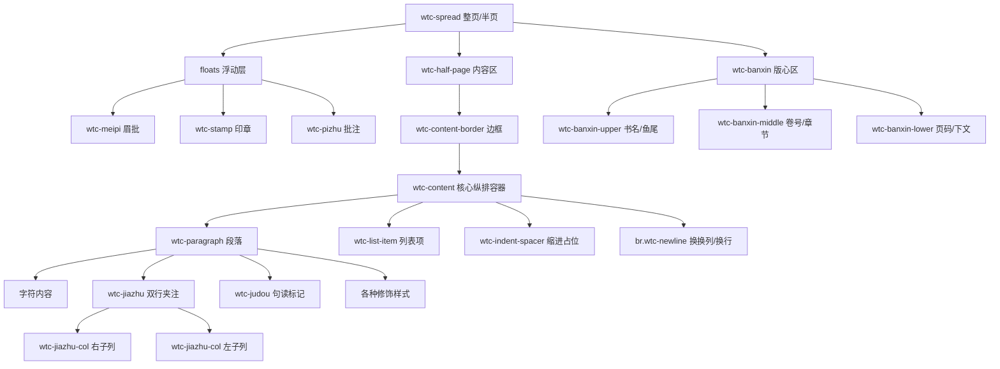

# HTML/CSS 渲染结构总结

本文档总结了 WebTeX-CN 从 TeX 源码到生成 HTML/CSS 的层级结构关系，描述了从页面容器到微观内容的各个组成部分。

## 1. 结构概览图示

## 2. 详细层级说明

### 2.1 顶层容器：页面 (Spread Level)
- **`.wtc-spread`**: 最外层容器，负责定义页面的物理尺寸、背景（如仿真纸张颜色）和基础内边距。
- **`.wtc-spread-right` / `.wtc-spread-left`**: 标识左右页，CSS 会根据此标识调整版心（Banxin）和正文区的布局顺序。

### 2.2 布局与版式 (Layout & Border)
- **`.wtc-half-page`**: 承载主体内容的区域。
- **`.wtc-content-border`**: 渲染古籍典型的线框（如四周黑口、细线框）。
- **`.wtc-content`**: **核心纵向排版容器**。
    - 使用 `writing-mode: vertical-rl` 开启纵向排版模式。
    - 这是所有正文内容流动的起点。

### 2.3 版心区 (Banxin/Marginalia)
版心作为古籍页面的结构化边缘信息，具有独立的层级：
- **`.wtc-banxin`**: 包含书名、鱼尾、页码等辅助信息。
- **`.wtc-yuwei`**: 渲染鱼尾装饰图样。
- **`.wtc-banxin-book-name` / `.wtc-banxin-chapter` / `.wtc-banxin-page-num`**: 结构化存储书籍元数据。

### 2.4 内容组织 (Block Level)
在纵向文本流中，内容按以下方式组织：
- **`.wtc-paragraph`**: 逻辑段落。
- **`.wtc-indent-spacer`**: 特殊的空 `span`。因为纵排模式下 `text-indent` 处理较为复杂，我们使用该元素通过 `height`（或 CSS 变量 `--wtc-indent-size`）实现行首的精确物理缩进。
- **` `**: 在纵向排版中，它强制文本流“换列”。

### 2.5 微观内容 (Inline Level)
- **`.wtc-jiazhu` (双行夹注)**: 
    - 内部包含两个并列的 `.wtc-jiazhu-col`。
    - 通过 CSS 将原本一行的小字拆分为紧凑的左右两列，模拟古籍中大字旁边的并排双行小字。
- **`.wtc-judou` (句读)**: 
    - 渲染为零宽或小尺寸的装饰性 `span`，位于文字侧边。
- **装饰性样式**:
    - `.wtc-emphasis`: 侧边着重号。
    - `.wtc-proper-name`: 垂直的专名线。
    - `.wtc-inverted` / `.wtc-octagon` / `.wtc-circled`: 模拟木板刻印中的反白效果或边框装饰。

## 3. 设计核心逻辑

1.  **物理网格对齐**: 通过 CSS 变量 `--wtc-grid-height` 提供全局的行高/字符步进基准，确保文字在视觉上是对齐的。
2.  **纵横转换**: 利用浏览器原生的垂直书写模式（Vertical Writing Mode），将复杂的排版计算公式简化为 DOM 的常规流动。
3.  **绝对 vs 相对**: 内容流（`.wtc-content`）使用流式排版，而装饰性元素（印章、眉批）则利用 `.wtc-spread` 容器进行绝对定位。
